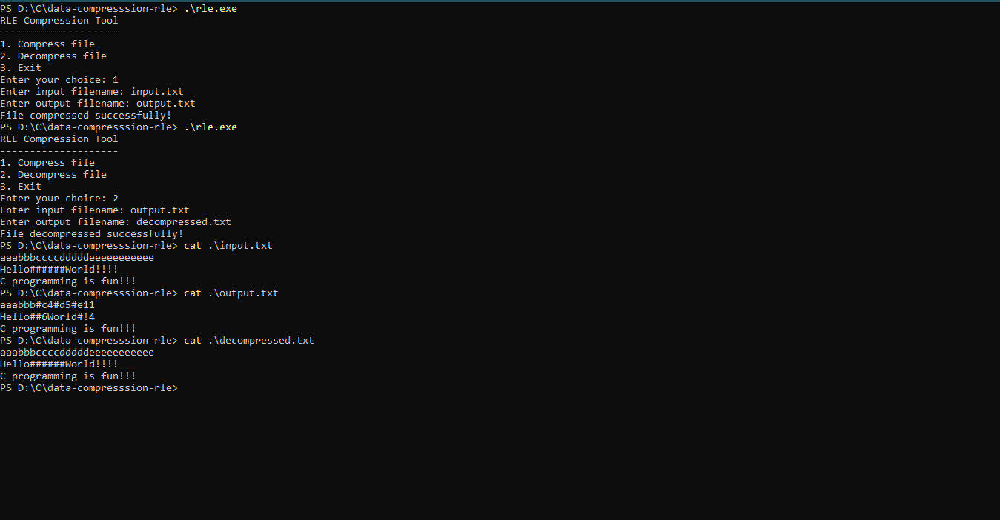

# RLE Compression Tool in C

* **Author:** Akshita Rawat
* **Intern ID:** CT04DN682
* **Company:** CODTECH IT SOLUTIONS
* **Mentor:** Neela Santosh
* **Domain:** C Programming
* **Duration:** 4 Weeks

---

## 📌 Overview

This project implements a simple **Run-Length Encoding (RLE)** compression and decompression tool in the C programming language. It reads a text file, compresses repeated characters using RLE, and can later decompress them back to the original form.

This is a beginner-friendly project to understand **lossless compression algorithms** and file I/O in C.

---

## ✅ Features

* Compresses files using Run-Length Encoding (RLE)
* Decompresses RLE-encoded files back to their original content
* Skips compression if repeated character count is 3 or less (for efficiency)
* Uses `#` as a special marker for encoded segments
* Handles special characters safely (e.g., if the character is `#`)
* Easy-to-use CLI menu

---

## 🔍 RLE Encoding Format

* Characters repeated more than 3 times or special character `#` are replaced with:

  ```
  #<character><count>
  ```

  Example:

  ```
  Input:    aaabbbbbbcccc##
  Output:   aaab#b6ccc##2
  ```

---

## 🛠️ Technologies Used

* **C Programming Language**
* Standard Libraries:

  * `stdio.h` for file operations
  * `stdlib.h` for memory handling
  * `string.h`, `ctype.h` for character checks

---

## 📂 File Structure

```
rle_tool.c                # Main source code file
input.txt                 # Sample input text to compress
compressed.txt            # Output after compression
decompressed.txt          # Output after decompression
README.md                 # Documentation
```

---

## ▶️ How to Compile and Run

```bash
gcc rle_tool.c -o rle
./rle
```

---

## 🧪 Example Interaction



## 📚 What I Learned

* Implementing a basic **lossless compression algorithm**
* Managing **file pointers** and character buffers
* Using **`fgetc` / `fputc` / `fprintf` / `ungetc`** for low-level file I/O
* Safely handling **special characters** during encoding
* Ensuring user input validation and robust error handling
